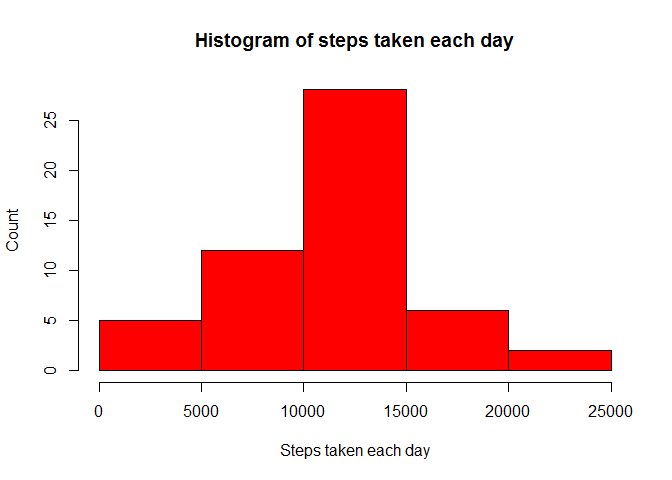
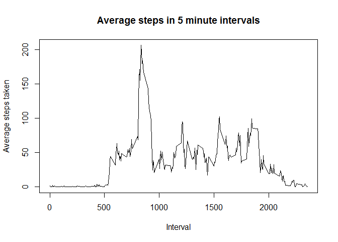
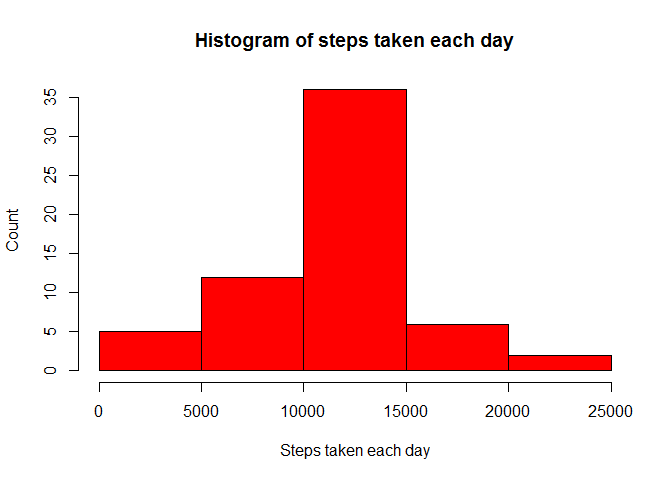
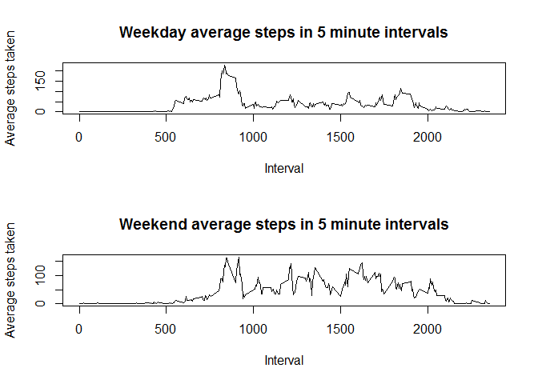

# Reproducible Research: Peer Assessment 1


## Loading and preprocessing the data

```r
data<-read.csv(file="data/activity.csv", header = TRUE, colClasses = c("integer","Date","integer"))
summary(data)
```

```
##      steps             date               interval     
##  Min.   :  0.00   Min.   :2012-10-01   Min.   :   0.0  
##  1st Qu.:  0.00   1st Qu.:2012-10-16   1st Qu.: 588.8  
##  Median :  0.00   Median :2012-10-31   Median :1177.5  
##  Mean   : 37.38   Mean   :2012-10-31   Mean   :1177.5  
##  3rd Qu.: 12.00   3rd Qu.:2012-11-15   3rd Qu.:1766.2  
##  Max.   :806.00   Max.   :2012-11-30   Max.   :2355.0  
##  NA's   :2304
```
*Omitting where the device has not been recording steps (NA).*

```r
activity_df <- na.omit(data)
```

## What is mean total number of steps taken per day?

```r
day_sums<-aggregate(activity_df$steps, list(date = activity_df$date), sum)
names(day_sums)<-c("date", "sum")
hist(day_sums$sum, xlab="Steps taken each day", ylab="Count", main="Histogram of steps taken each day", col=2)
```

<!-- -->

```r
mean_steps<-mean(day_sums$sum)
median_steps<-median(day_sums$sum)
```
The mean number of steps taken each days is 10766.19.      
The median number of steps taken each day is 10765.00.


## What is the average daily activity pattern?

```r
avg_steps_int<-aggregate(activity_df$steps, list(interval = activity_df$interval), mean)
plot(avg_steps_int$interval, avg_steps_int$x, type="l",
     xlab="Interval", ylab="Average steps taken", main="Average steps in 5 minute intervals")
```

<!-- -->

```r
max_steps<-max(avg_steps_int$x)
max_steps_interval<-avg_steps_int[avg_steps_int$x==max_steps,1]
```
The 5 minute interval where the maximum number of steps taken on average each days is 835.


## Imputing missing values

```r
missing_values<-data[is.na(data),]
number_missing_values<-nrow(missing_values)
```
The number of missing values is 2304.

*Using the average steps taken in a 5 minute interval to replace where the steps are NA.*

```r
imp_data<-data
for(i in 1:number_missing_values)
{
      dt<-missing_values[i,]$date
      int<-missing_values[i,]$interval
      if(nrow(avg_steps_int[avg_steps_int$interval==int,])>0)
      {
      imp_data[imp_data$date==dt & imp_data$interval==int,]$steps<-avg_steps_int[avg_steps_int$interval==int,]$x
      }
}
summary(imp_data)
```

```
##      steps             date               interval     
##  Min.   :  0.00   Min.   :2012-10-01   Min.   :   0.0  
##  1st Qu.:  0.00   1st Qu.:2012-10-16   1st Qu.: 588.8  
##  Median :  0.00   Median :2012-10-31   Median :1177.5  
##  Mean   : 37.38   Mean   :2012-10-31   Mean   :1177.5  
##  3rd Qu.: 27.00   3rd Qu.:2012-11-15   3rd Qu.:1766.2  
##  Max.   :806.00   Max.   :2012-11-30   Max.   :2355.0
```
*Now there are no missing values.*


**Recalculating step stats.**

```r
imp_day_sums<-aggregate(imp_data$steps, list(date = imp_data$date), sum)
names(imp_day_sums)<-c("date", "sum")
hist(imp_day_sums$sum, xlab="Steps taken each day", ylab="Count", main="Histogram of steps taken each day", col=2)
```

<!-- -->

```r
imp_mean_steps<-mean(imp_day_sums$sum)
imp_median_steps<-median(imp_day_sums$sum)
```
The mean number of steps taken each days is 10766.19. This is the same as before.     
The median number of steps taken each day is 10766.19. This has increased to be equal to the mean.   
*Imputing the missing values has made no change to the mean number of steps taken each day, but has made the median number of steps rise to be the same as the mean.*

## Are there differences in activity patterns between weekdays and weekends?
**Week daily patterns**

```r
library(lubridate)
```

```
## Warning: package 'lubridate' was built under R version 3.3.1
```

```
## 
## Attaching package: 'lubridate'
```

```
## The following object is masked from 'package:base':
## 
##     date
```

```r
weekday_activity_df<-imp_data[wday(ymd(imp_data$date)) %in% 2:6,]
weekday_avg_steps_int<-aggregate(weekday_activity_df$steps, list(interval = weekday_activity_df$interval), mean)

weekend_activity_df<-imp_data[wday(ymd(imp_data$date)) %in% c(7,1),]
weekend_avg_steps_int<-aggregate(weekend_activity_df$steps, list(interval = weekend_activity_df$interval), mean)

par(mfrow=c(2,1))

plot(weekday_avg_steps_int$interval, weekday_avg_steps_int$x, type="l",
      xlab="Interval", ylab="Average steps taken", main="Weekday average steps in 5 minute intervals")
plot(weekend_avg_steps_int$interval, weekend_avg_steps_int$x, type="l",
      xlab="Interval", ylab="Average steps taken", main="Weekend average steps in 5 minute intervals")
```

<!-- -->

```r
weekday_max_steps<-max(weekday_avg_steps_int$x)
weekday_max_steps_interval<-weekday_avg_steps_int[weekday_avg_steps_int$x==weekday_max_steps,1]

weekend_max_steps<-max(weekend_avg_steps_int$x)
weekend_max_steps_interval<-weekend_avg_steps_int[weekend_avg_steps_int$x==weekend_max_steps,1]
```

The 5 minute interval where the maximum number of steps taken on average during weekdays is 835.

The 5 minute interval where the maximum number of steps taken on average during weekends is 915.

**The maximum daily steps taken in a 5 minute interval starts slightly later in the day on weekends. Similarly, activity starts later and ends later in the day at weekends. Also more activity in total can be seen to occur at weekends.**


